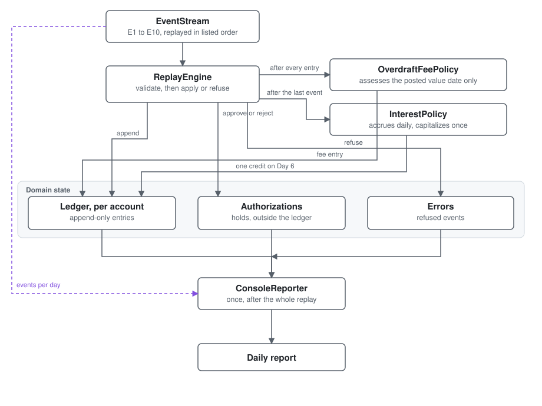

# In-Memory account ledger core

## Architecture and trade-offs

The design of this ledger, and the price of each decision in it.

Three documents carry their own concerns and are not repeated here: every constant and what
changing it costs is in [NUMBERS.md](NUMBERS.md), open questions and how it was
resolved is in [AMBIGUITIES.md](AMBIGUITIES.md), and the refused acceptance criteria and abandoned
approaches are in [REJECTED.md](REJECTED.md).

[README.md](README.md) covers running it.

## 1. Scope

A deterministic, in-memory ledger core. It replays a fixed event stream over six days and
prints, for each account and day, the events replayed, the closing balance, fees, authorization
outcomes and refusals.

Kotlin on the JVM, built with Gradle. The only runtime dependency is the Kotlin standard library.
Tests use JUnit 5 through `kotlin.test`.

Out of scope by choice: persistence, concurrency, a web layer, FX, event-store or CQRS frameworks,
dependency injection containers, and an interface per class.

| Account | Currency | Precision | Opening balance |
|---------|----------|-----------|----------------:|
| ACC-001 | AED      | 2 dp      |            0.00 |
| ACC-002 | BHD      | 3 dp      |           0.000 |

### The event stream

Referenced throughout, so recorded once here. Replayed in this order, which is not sorted by
booking day.

| Event | Booked | Action                              | Account |       Amount | Value date     |
|-------|--------|-------------------------------------|---------|-------------:|----------------|
| E1    | Day 1  | Credit                              | ACC-001 | AED 1,200.00 | Day 1          |
| E2    | Day 1  | Debit                               | ACC-001 |   AED 950.00 | Day 1          |
| E3    | Day 2  | Authorize Auth-A                    | ACC-001 |   AED 200.00 | n/a            |
| E4    | Day 3  | Credit                              | ACC-001 |   AED 400.00 | Day 3          |
| E5    | Day 4  | Settle Auth-A                       | ACC-001 |   AED 185.00 | Day 4          |
| E6    | Day 4  | Settle Auth-Z, which does not exist | ACC-001 |   AED 180.00 | Day 4          |
| E7    | Day 5  | Debit                               | ACC-001 |   AED 620.00 | **Day 2**      |
| E8    | Day 5  | Authorize Auth-B                    | ACC-001 |    AED 90.00 | n/a            |
| E9    | Day 6  | Reverse E7                          | ACC-001 |   AED 620.00 | Day 2, from E7 |
| E10   | Day 5  | Credit in 3 instalments             | ACC-002 |   BHD 10.000 | Day 5          |

E7 is the reason this exercise is not trivial. It arrives on Day 5 carrying a value date three days
earlier, so it changes what an already-closed day was worth.

## 2. Structure



Four moving parts and one direction of flow. The engine is a fold over the event list: it holds no
clock, no configuration and no I/O, so the same events always produce the same state.

Two edges are worth noting. The fee policy runs after every posted entry rather than at the close of
a day, for the reason in section 5. The reporter reads the event stream directly, because a day's
block shows what arrived as well as what it did.

## 3. Domain model


| Type            | Responsibility                                                   |
|-----------------|------------------------------------------------------------------|
| `Money`         | An amount in one currency, as whole minor units                  |
| `Day`           | A day of the replay window, validated at construction            |
| `Account`       | Identity, currency, and where the balance started                |
| `LedgerEntry`   | One immutable line of history                                    |
| `Ledger`        | One account's append-only history, and the balance query over it |
| `Authorization` | A hold on available balance, with a lifecycle but no entry       |

Note the dashed line between `Account` and `Authorization`. A hold references an account but is not
owned by its ledger, which is the point of section 5.

## 4. How events are processed

Each event is validated, then either applied or refused and recorded with no ledger effect.

| Event             | Rule                                                                                                                                            |
|-------------------|-------------------------------------------------------------------------------------------------------------------------------------------------|
| Credit            | Append a credit at the event's value date                                                                                                       |
| Debit             | Append a debit at the event's value date. A booked debit is never declined, which is what lets E7 drive Day 2 negative                          |
| Authorization     | Approve when available balance less the requested amount stays at or above zero. Never appends an entry                                         |
| Settlement        | Requires an authorization that exists, belongs to this account, and is still approved. On acceptance, append a debit and release the whole hold |
| Reversal          | Append a compensating entry at the original's value date, referencing it. The original is never touched                                         |
| Instalment credit | Split the total exactly, then append one credit per instalment                                                                                  |

Refusal reasons are enumerated :
unknown authorization, authorization belongs to another account, authorization already settled,
authorization was rejected, settlement exceeds authorized amount, currency mismatch, and
insufficient available balance.

## 5. The decisions, and what each one cost

### Money is integer minor units, validated at construction

An amount is a `Long` count of minor units and a currency, rounded to the currency's scale by the
only factory that accepts a decimal. Cross-currency arithmetic throws rather than converting.

**Bought:** an unrounded or mixed-currency amount cannot be constructed, so nothing downstream has
to defend against one. Binary floating point never touches a balance.

**Gave up:** hand-written equality, no `copy()`, and a separate `BigDecimal` path for interest that
converts back exactly once. Rounding stays out of arithmetic entirely, so `plus` and `minus` are
exact integer operations.

**In production:** any FX at all touches `Money`, and everything depends on `Money`. There is no
rate source, no revaluation and no position keeping.

### Balances are derived from history, not stored

There is no running total. A day's closing balance is computed from the entries value-dated on or
before it.

**Bought:** backdating needs no special casing anywhere. E7 changes what Day 2 closed at because
the balance is re-derived, not because something went back and adjusted a stored number.

**Gave up:** the derivation has to be cheap, and at first it was not. `closingBalance` filtered the
whole entry list on every call, and the fee policy calls it once per posted entry, so a replay was
quadratic in the number of entries. `Ledger` now maintains signed totals per value date and entry
type, updated on append, so the query sums at most one cell per day per type. Splitting by type as
well as by day is what keeps the interest base an exact filter rather than an approximation.

The index is derived, not a second source of truth: the entry list remains the only record and
`append` remains the only writer. A stale index is the one new failure this introduces, so a test
recomputes every balance by scanning history and asserts the index agrees.

**In production:** the index grows one row per day per account forever, with the entries in memory
behind it. The real fix is to close the books: materialise a balance at period end and read that
checkpoint plus only the entries after it, so history stays immutable and old entries can move to
cold storage. Indexing first was the right order because it is contained. Checkpointing is not: it
needs a period-close and a rule for back-valued entries landing before a checkpoint, which is the
control in section 7.

### Append-only is enforced by the type system

`Ledger` exposes `append` and nothing else that writes. `LedgerEntry` has a private constructor and
no `copy()`, and `entries()` hands out a copy so the backing list is never reachable in mutable
form.

**Bought:** "a posted entry cannot be altered" is a property of the types rather than a rule
contributors must remember. A `data class` was tried and rejected: its synthesised `copy()` would
clone an entry carrying the original's id and an amount nobody validated, and `LedgerEntry` cannot
re-check that itself, because it holds an account id rather than an account and so does not know
the account's currency. That check exists in one place, and `copy()` would walk past it.

**Gave up:** boilerplate, and one honest overstatement. The factory is `internal`, which in a
single-module build means visible to the whole module rather than to `Ledger` alone. "Only the
ledger creates entries" is therefore a convention, not a compiler guarantee, and the source says so.

**In production:** append-only is why a fee outlives the reversal of the entry that caused it. That
is correct, and it is also a dispute queue. A real ledger answers this with a compensating
fee-reversal event, which this model cannot express.

### Holds live outside the ledger

An authorization is state with a lifecycle, not an entry. It moves available balance and never
ledger balance.

**Bought:** the ledger contains only money that actually moved, which is what makes append-only
literally true rather than approximately true.

**Gave up:** a second piece of state to keep consistent, and an available balance derived on demand.

**In production:** this is where the model is thinnest. Section 8 sets out what it cannot express.

### Policy lives in the replay engine, not in the ledger

`Ledger` knows nothing about fees, interest or events. The engine posts an entry, then asks the fee
policy to assess that entry's value date.

**Bought:** a data structure with no behaviour to mock and no policy baked in, which is why the
invariant tests are as short as they are.

**Gave up:** the pairing of "append, then assess" is a convention held in one method of the engine.
Nothing enforces it, so the moment a second call site posts an entry, the fee can be skipped in
silence. This is the decision most likely to age badly, and it is cheap to close: make `append`
reachable only through the engine, or have it return something the caller must hand to the policy.

### A reversal is a compensating entry, not an entry type

Reversing a debit appends a credit carrying a reference to what it offsets.

**Bought:** the sign rule stays a total function of the entry type, with no special cases and no
fifth enum constant for every `when` to handle.

**Gave up:** knowing that an entry is a reversal means following a reference rather than reading
its type.

**In production:** the same mechanism should carry fee reversals and authorization voids, neither of
which exists. The shape is right and the vocabulary is incomplete.

### The overdraft fee is triggered by the value date of the entry just posted

The brief says a day is charged when its closing balance is negative, but never says when that is
evaluated or across how many days. With a backdated entry in the stream, that gap decides the
answer: at the instant E7 posts, four separate days are overdrawn at once. Re-scanning the window
charges four fees, and sweeping at the end charges none, because E9 has by then made every day
positive. AMBIGUITIES.md sets out all four readings and what each produces.

**Bought:** the only rule consistent with the expected outcome, and a small one. Assess the day the
entry is value-dated to, and no other. The idempotency key is claimed before the fee is posted,
because the fee is itself value-dated to that day and leaves it still overdrawn.

**Gave up:** a day pushed overdrawn purely by a backdated entry elsewhere is never charged. That is
defensible, and it is a choice rather than a derivation.

**In production:** it needs an owner. Whether a customer is charged for a day they were overdrawn
only in retrospect is a product and conduct question, and the answer changes revenue.

### Interest sums rounded dailies, from a base that excludes itself

The capitalized total is defined as the sum of the rounded daily accruals, and each day's base
excludes capitalization entries.

**Bought:** the requirement that the dailies sum exactly to the total holds by construction, so no
remainder can exist to be discarded. Excluding capitalization from the base breaks a circular
definition, since Day 6's accrual would otherwise be computed from a balance containing itself.

**Gave up:** the most-used query in the codebase needs an exclusion parameter it would not
otherwise have.

**In production:** the accrual is recomputed from final balances at the end of the run, which
quietly restates interest for periods that have already closed. Fine over six days with nothing yet
reported, and not fine once a statement has been issued.

### The report is produced once, after the replay

**Bought:** the figures match, because a day's closing balance is whatever history finally says it
is.

**Gave up:** the system cannot reproduce what a statement said on the day it was issued. During the
run, Day 3 stood at AED 650.00; the report shows AED 625.00, because a fee value-dated to Day 2 did
not exist until two days later.

**In production:** reproducing a historical statement is routine, and this design cannot answer it
without keeping the report itself as a record.

## 6. Expected outcome

`AcceptanceCriteriaTest` pins every figure below and the report text
in full.

**ACC-001, AED.** One overdraft fee, AED 25.00, value-dated Day 2.

| Day |    Closing | Interest base | Accrual |
|-----|-----------:|--------------:|--------:|
| 1   |     250.00 |        250.00 |    0.10 |
| 2   |     225.00 |        225.00 |    0.09 |
| 3   |     625.00 |        625.00 |    0.25 |
| 4   |     440.00 |        440.00 |    0.18 |
| 5   |     440.00 |        440.00 |    0.18 |
| 6   | **440.98** |        440.00 |    0.18 |

Capitalized on Day 6: AED 0.98. Day 2 reconciles as `250.00 - 620.00 - 25.00 + 620.00 = 225.00`,
which is the reversal returning the amount while the fee stays.

**ACC-002, BHD.** Days 1 to 4 at 0.000, Day 5 at 10.000, Day 6 at **10.008**. Accruals of 0.004 on
Days 5 and 6, capitalized at BHD 0.008. No fee.

**Authorizations.** Auth-A approved with AED 50.00 of headroom, then settled on Day 4, releasing the
hold in full. Auth-Z rejected as unknown, taking no money. Auth-B rejected, since available balance
stood at AED -180.00 and the hold would have taken it to AED -270.00.

One day of the report, showing the shape:

```
Day 5
  Events                  : E7 DEBIT AED 620.00, value-dated Day 2; E8 AUTHORIZATION Auth-B AED 90.00
  Closing ledger balance  : AED 440.00
  Fees                    : none
  Authorizations          : Auth-B REJECTED
  Errors                  : E8 insufficient available balance
```

Within a day block the balance and fee lines are value-dated, while the events, authorization and
error lines are booking-dated. That mixture is deliberate: the Day 2 fee was assessed on booking
Day 5, so filing it under Day 5 would misstate when the account was overdrawn.


## 7. Tests

Unit tests cover money rounding and currency rejection, the day window, the sign rule, settlement
refusal for each enumerated reason, fee idempotency, interest rounding, and the instalment split as
a property across a range of totals and counts.

Invariant tests assert that no entry is ever mutated or removed across a full replay, that exactly
one overdraft fee exists at the end, that the daily accruals sum to the capitalized total, and that
the balance index agrees with a full scan of history for every day and every exclusion.

An acceptance test replays the whole stream and asserts every figure in section 6 plus the report
text byte for byte.

One test fails on purpose. It encodes the acceptance criterion claiming that reversing E7 restores
the pre-E7 state, which append-only makes false. It is tagged `known-failure` and excluded from
`test`, so the build stays green, and it runs on demand through `./gradlew knownFailureTest`.
